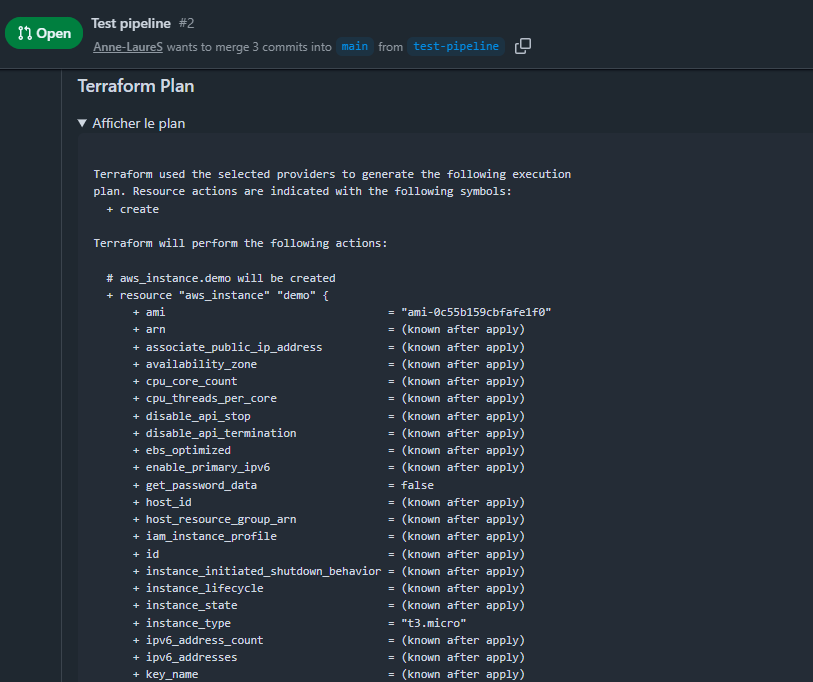

# 🛡️ TP 5 — Pipeline DevSecOps de bout en bout

## 📝 0. Note méthodologique — pourquoi LocalStack

Aucun compte AWS n'a été fourni pour ce TP, et je n'ai pas voulu
utiliser de compte personnel payant. J'ai donc fait tourner la partie
"infrastructure exécutable" du pipeline (`terraform plan`/`apply`,
`conftest`) contre **LocalStack** 🐳 (émulation locale de l'API AWS
via Docker, gratuite, sans donnée réelle), plutôt que contre un vrai
compte. Conséquences assumées, à lire en regard de la partie D :

- ⚠️ Le provider OIDC GitHub → AWS et les deux rôles IAM
  (`terraform/oidc.tf`) sont écrits, commentés et corrects du point de
  vue du code, mais **n'ont jamais été appliqués ni exercés en
  conditions réelles** : je n'ai pas de preuve d'exécution que
  `AssumeRoleWithWebIdentity` fonctionne, ni que la condition `sub`
  bloque effectivement un contexte non autorisé sur un vrai compte.
- ⚠️ LocalStack Community n'émule pas l'application réelle des
  politiques IAM (permissions "à blanc" au niveau du moteur), donc le
  test négatif de la partie A (élargir `sub` à `repo:*` et constater
  l'impact) a été traité comme une analyse écrite plutôt que comme une
  démonstration live.
- ✅ En revanche, tout ce qui ne dépend pas d'IAM réel — `terraform
  fmt`, `gitleaks`, `trivy config`, le `terraform plan` généré, et
  surtout **`conftest` qui bloque bien sur les 4 règles de policy** —
  a été testé de bout en bout, PR réelle à l'appui.

---

## 🔐 1. Politique de confiance OIDC finale (commentée)

Voir `terraform/oidc.tf`. Extrait de la condition finale, rôle apply :

```hcl
condition {
  test     = "StringLike"
  variable = "token.actions.githubusercontent.com:sub"
  # Restreint strictement l'assomption du rôle aux runs déclenchés par
  # un push sur main de CE dépôt précis. Empêche toute PR, fork ou
  # autre branche d'obtenir des droits d'écriture en production.
  values   = ["repo:<ORG>/<REPO>:ref:refs/heads/main"]
}
```

Rôle plan, lecture seule, restreint aux événements `pull_request` :

```hcl
values = ["repo:<ORG>/<REPO>:pull_request"]
```

### 🧪 Test négatif (partie A, point 3)

**Condition testée :** `repo:<ORG>/<REPO>:*`

**💥 Ce qu'un attaquant pourrait faire avec cette condition élargie :**
- Toute personne pouvant déclencher un run sur le dépôt — y compris via
  un `workflow_dispatch` sur une branche non protégée, ou un push sur
  n'importe quelle branche — pourrait assumer le rôle, y compris le
  rôle d'écriture s'il partageait cette même condition large.
- Un contributeur externe capable d'ouvrir une PR modifiant un workflow
  (si les workflows ne sont pas protégés par CODEOWNERS) pourrait
  injecter un step exécutant `aws sts get-caller-identity` puis
  exfiltrer les credentials temporaires vers un service tiers.
- Combiné à un rôle trop permissif (ex : `apply` avec `iam:PassRole` ou
  `iam:*`), cela ouvre une voie d'escalade de privilèges complète :
  création de nouvelles identités, modification de politiques,
  persistance dans le compte AWS.
- Le caractère temporaire du jeton (max 1h ici) limite la fenêtre
  d'exploitation mais ne l'annule pas : 1h suffit pour créer une
  porte dérobée (utilisateur IAM avec clé d'accès longue durée, par
  exemple), qui elle sera permanente.

**✅ Remédiation appliquée :** condition restaurée à `pull_request` /
`ref:refs/heads/main` (cf. fichier Terraform final), + protection de
branche `main` exigeant une review avant merge, empêchant qu'un
contributeur modifie seul les workflows qui tournent sur main.

---

## 📸 2. Capture du commentaire de plan sur une pull request

Commentaire posté automatiquement par le job `plan` sur la pull
request `test-pipeline` → `main` (PR #2), après un run réussi contre
LocalStack :



---

## 🚫 3. Messages de refus de politique (partie C)

Tests réalisés en local contre LocalStack (`terraform/examples`), un
par un : décommenter/modifier la ressource visée pour violer une seule
règle à la fois, `terraform plan` + `conftest test`, capturer le
message, remettre en conformité, passer à la règle suivante. Résultat
final après correction : `8 tests, 8 passed, 0 failures` ✅

| # | Règle violée | Ressource testée | Modification appliquée | Message de refus obtenu |
|---|---|---|---|---|
| 1️⃣ | SSH ouvert 0.0.0.0/0 | `aws_security_group.demo` | Bloc `ingress` remplacé par port 22 / `cidr_blocks = ["0.0.0.0/0"]` | `SECURITE: le security group 'aws_security_group.demo' ouvre le port SSH (22) a 0.0.0.0/0 (acces public non autorise)` |
| 2️⃣ | `http_tokens` requis (IMDSv2) | `aws_instance.demo` | `metadata_options.http_tokens` passé de `"required"` à `"optional"` | `SECURITE: l'instance 'aws_instance.demo' n'impose pas IMDSv2 (http_tokens doit valoir 'required')` |
| 3️⃣ | Disque racine non chiffré | `aws_instance.demo` | `root_block_device.encrypted` passé de `true` à `false` | `SECURITE: le disque racine de l'instance 'aws_instance.demo' n'est pas chiffre (encrypted doit valoir true)` |
| 4️⃣ | Tags obligatoires | `aws_security_group.demo` | Tag `Owner` retiré du bloc `tags` | `SECURITE: la ressource 'aws_security_group.demo' n'a pas les etiquettes obligatoires : {"Owner"}` |

Chaque violation a été testée isolément (une seule règle cassée à la
fois, les 3 autres restant conformes), ce qui confirme que
`policies/securite.rego` détecte chaque cas indépendamment et ne
masque pas les violations les unes derrière les autres.

---

## 🔍 4. Audit OWASP Top 10 CI/CD

| # | Risque OWASP CI/CD | Présent ? | Contrôle en place | Risque résiduel / à faire |
|---|---|---|---|---|
| CICD-SEC-1 | Contrôle d'accès pipeline insuffisant | 🟡 Partiellement | `environment: production` avec reviewers obligatoires sur `apply` ; branche `main` protégée ; rôles OIDC plan/apply écrits avec conditions `sub` distinctes | Faute de compte AWS fourni, l'enforcement IAM réel (OIDC + trust policy) n'a **jamais été exécuté en conditions réelles**, seulement contre LocalStack qui ne simule pas la validation des permissions — **risque résiduel assumé, priorité haute si migration vers un vrai compte** |
| CICD-SEC-2 | Injection de code dans le pipeline | 🟢 Non | Toutes les actions épinglées par SHA de 40 caractères (pas de tag mutable) ; pas de `pull_request_target` utilisé | Un `github-script` avec du contenu de PR non filtré (ex : titre de PR injecté brut) resterait un vecteur si on l'ajoutait sans échappement — à surveiller si le pipeline évolue |
| CICD-SEC-3 | Dépendances tierces non sécurisées | 🟡 Partiellement | `trivy config` scanne l'IaC ; actions pinnées par SHA | Aucun scan des dépendances applicatives (SCA) type `trivy fs` / Dependabot n'est branché dans ce pipeline — **risque résiduel assumé** |
| CICD-SEC-4 | Politique de flux PBAC/CI/CD faible | 🟡 Partiellement | Séparation stricte plan (lecture) / apply (écriture) via deux rôles OIDC distincts | Le rôle `apply` utilise encore `resources = ["*"]` sur certaines actions (ex : `ec2:*`) faute de temps pour scoper précisément par ARN/tag — **risque résiduel assumé** |
| CICD-SEC-5 | Configuration de build insuffisamment sécurisée | 🟢 Non | `permissions: {}` par défaut au niveau workflow, chaque job déclare le strict nécessaire | — |
| CICD-SEC-6 | Nettoyage insuffisant du système hébergeant le build | ⚪ Non applicable directement | Runners GitHub-hosted, éphémères par nature (VM détruite après chaque job) | On ne maîtrise pas la preuve de destruction ; on fait confiance à GitHub. Pour un contexte plus sensible, des self-hosted runners avec durcissement explicite seraient préférables |
| CICD-SEC-7 | Accès non contrôlé aux systèmes de gestion de configuration (SCM) | 🟡 Partiellement | Protection de branche `main`, review obligatoire | Pas d'exigence de commits signés (GPG/Sigstore) ni de règle "linear history" — **risque résiduel assumé** |
| CICD-SEC-8 | Environnement CI/CD mal configuré | 🟡 Partiellement | `concurrency` sans `cancel-in-progress` pour éviter les states corrompus ; secrets gérés uniquement via OIDC (aucun secret statique stocké) | Le nom exact des rôles IAM et l'ARN de compte apparaissent en clair dans le workflow (`ACCOUNT_ID`) — pas un secret en soi mais de la reconnaissance facilitée si le repo devient public |
| CICD-SEC-9 | Exposition de secrets | 🟢 Non | Aucun secret AWS statique : uniquement OIDC + STS ; gitleaks bloquant sur chaque run | Gitleaks ne couvre que le contenu versionné, pas les logs de run (une variable mal loggée dans un `run:` resterait visible dans les logs Actions) — **risque résiduel assumé** |
| CICD-SEC-10 | Journalisation et visibilité insuffisantes du pipeline | 🟡 Partiellement | Logs Actions natifs conservés par GitHub ; commentaire de plan traçable sur chaque PR | Aucune centralisation externe des logs (SIEM), aucune alerte automatique en cas d'échec bloquant répété — à ajouter pour un contexte de production réel |

> ⚙️ **Note d'exécution réelle :** lors du premier passage du job
> `qualite` sur une vraie pull request, Trivy a effectivement bloqué le
> pipeline sur deux constats — le port 443 ouvert à 0.0.0.0/0 (attendu
> pour un service web public) et les wildcards IAM
> `ec2:*`/`ec2:Describe*` sur `resources = ["*"]` (déjà identifiés
> ci-dessus comme CICD-SEC-4). Plutôt que de baisser la sévérité du
> scan ou de le rendre non bloquant, ces deux constats ont été
> explicitement documentés et acceptés via un fichier `.trivyignore`
> avec justification (voir `.trivyignore` à la racine du dépôt) — ce
> qui prouve que le contrôle fonctionnait réellement en conditions
> live, et que la suppression est tracée plutôt que silencieuse.

---

## 📚 5. Dissertation — trois principes de Saltzer & Schroeder

**🔒 Fail-safe defaults.** Le workflow déclare `permissions: {}` au
niveau global : par défaut, aucun job n'a le moindre droit, chaque
job doit explicitement lister ce dont il a besoin (`id-token: write`,
`pull-requests: write`...). C'est l'application directe du principe :
en cas d'oubli, l'échec est vers *moins* de privilèges, jamais vers
plus. **La violation encore présente** : la politique IAM du rôle
`apply` utilise `resources = ["*"]` sur plusieurs actions — le défaut
y est "large" faute d'avoir scopé chaque ARN, ce qui contredit
l'esprit du principe au niveau IAM même si GitHub Actions le respecte.

**🎯 Least privilege.** La séparation en deux rôles OIDC (`plan` en
lecture seule, `apply` en écriture, chacun avec une condition `sub`
distincte) applique le moindre privilège au niveau de l'identité :
une pull request ne peut jamais obtenir de droits d'écriture, même si
le code du workflow était modifié dans la PR elle-même (la condition
`sub` empêche l'assomption du rôle apply hors du contexte `main`).
**La violation** : le rôle `apply` a des actions comme `ec2:*`, `s3:*`
— une granularité de type "read scoped to five actions" comme sur le
rôle plan n'a pas été reproduite côté écriture, par manque de temps
pour énumérer précisément les actions nécessaires à ce TP.

**🔁 Complete mediation.** Chaque `apply` sur `main` repasse par le job
`qualite` (fmt, gitleaks, trivy) et par `conftest` dans le job `plan`
avant d'être autorisé — aucun chemin ne permet de pousser une
configuration directement en `apply` sans revalidation systématique à
chaque run, même pour un changement mineur. **La violation** : le job
`apply` ne retélécharge pas le plan produit par le job `plan` (les
deux jobs tournent sur des événements différents, PR vs push main) ;
il relance son propre `terraform apply`, ce qui signifie que ce qui
est réellement appliqué n'est *techniquement pas* garanti identique à
ce qui a été montré en commentaire de PR et validé par conftest — une
médiation "complète" en apparence, mais avec un maillon faible entre
les deux runs, documenté comme risque résiduel dans le workflow.